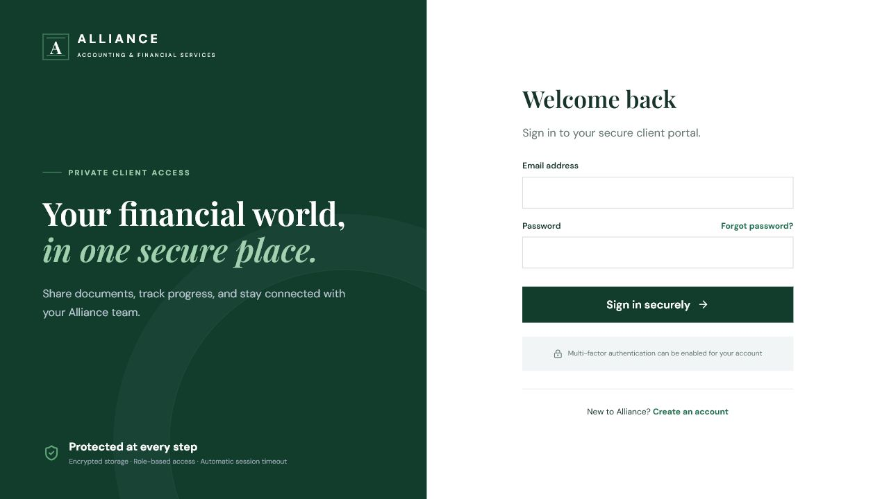
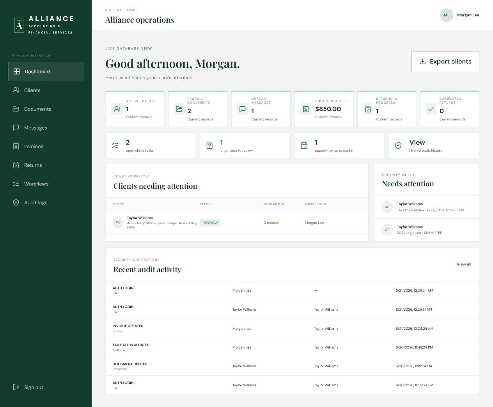
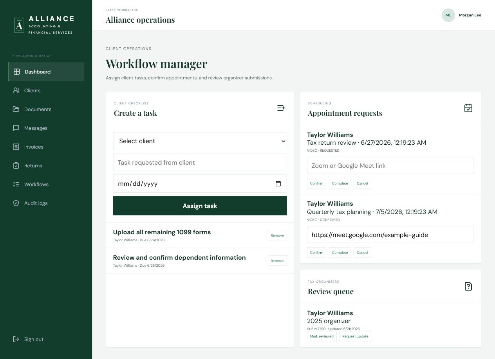
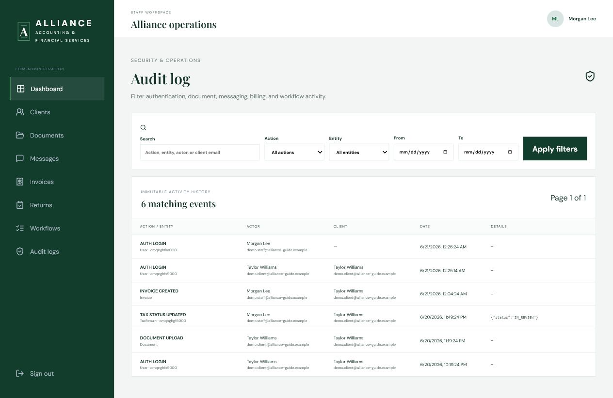

# AllianceAccounting Staff and Administrator Guide

This guide explains the Phase 3 staff workspace. It is written for firm staff and administrators, not developers.

> Screenshots use fictitious demo users and records. They contain no real client or credential data.

## 1. Before using the system

Use a firm-managed computer with current security updates, disk encryption, antivirus protection, and a supported browser. Do not use public/shared computers or public Wi-Fi for taxpayer information.

A staff or administrator account must be provisioned with the `STAFF` or `ADMIN` role. Public registration creates client accounts only. Do not share accounts; audit records identify the signed-in user who performs an action.

Provider accounts—email, hosting, AWS, Stripe, database, and GitHub—must use multi-factor authentication. Phase 3 reserves portal MFA fields but does not yet provide a complete end-user MFA setup/challenge screen.

## 2. Sign in and sign out

1. Open the firm's HTTPS website and choose **Client Login**.
2. Enter the staff email and password.
3. After authentication, open `/admin` if the dashboard is not shown automatically.
4. When finished, select **Sign out** in the left navigation.

The session lasts up to eight hours. Close the browser and sign out whenever leaving the workstation. Never allow the browser to save a staff password on an unmanaged device.

If login fails:

- Confirm the email address and that the account is verified.
- Use **Forgot password** for a one-hour reset link.
- Ask the system administrator to confirm that the account role is `STAFF` or `ADMIN`.
- Never ask a colleague for their password.

## 3. Staff dashboard

Open **Dashboard** or `/admin`.

Use the dashboard in this order:

1. Review the six summary cards for urgent counts and balances.
2. Open the workload cards for tasks, organizers, or appointments.
3. Check **Clients needing attention** for missing documents and assignments.
4. Review the priority queue and recent audit activity.
5. Export the client list only when an approved business process requires it.

The summary cards show:

- Active clients.
- Pending document requests.
- Unread client messages.
- Total unpaid/overdue invoice balance.
- Returns in progress.
- Completed returns.

The workload strip adds open client tasks, organizers awaiting review, requested appointments, and a shortcut to the audit history.

The client table shows recent clients, filing type, latest return status, missing-document count, and assigned staff member. The priority queue highlights upcoming appointment requests and submitted organizers. The recent audit panel shows the latest recorded activity.

### Export the client list

Select **Export clients** on the dashboard. The downloaded CSV contains client name, email, phone, tax year, and filing type.

Treat the export as taxpayer information:

- Save it only to an approved encrypted location.
- Do not send it through ordinary email.
- Delete temporary exports according to firm policy.
- Report a misplaced export immediately.

## 4. Workflow manager

Open **Workflows** in the left navigation or `/admin/workflows`.

The workflow manager has three working areas: client tasks, appointment requests, and submitted tax organizers. Process each item from the oldest or most urgent request unless firm policy specifies another priority.

### Assign a client task

1. Under **Create a task**, select the client.
2. Enter a specific, client-friendly task such as “Upload December bank statement.”
3. Add a due date when appropriate.
4. Select **Assign task**.

The task appears in the client's **My tasks** page. Completion and reopening are recorded in the audit log. Use **Remove** only when the task was created in error; completed tasks should normally remain as history.

Good task titles describe one action and avoid sensitive details. Do not include SSNs or full account numbers.

### Process appointment requests

Appointment cards show the client, topic, requested date/time, meeting type, and status.

1. Check the requested time against the staff calendar.
2. If using video, paste the approved Zoom or Google Meet URL into **Meeting link**.
3. Select **Confirm** only after reserving the time.
4. After the meeting, select **Complete**.
5. Select **Cancel** when the appointment will not occur, then notify the client through secure messaging.

The client's appointment page displays the status and confirmed meeting link. Avoid putting confidential client information in the meeting title or URL.

### Process tax organizer submissions

The organizer queue shows the client, tax year, submission status, and last update date.

- Select **Mark reviewed** when the organizer review is complete.
- Select **Request update** when the client must revise or add information. Send a secure message explaining what is needed.

Phase 3's workflow screen shows organizer status but does not yet include a polished answer-review panel. Organizer answers are encrypted in the database and retrievable through the authorized staff API; staff should follow the firm's approved technical workflow until that reader screen is added. Never request SSNs in the organizer notes.

## 5. Audit log

Open **Audit logs** or `/admin/audit-logs`.

The audit view can filter by:

- Search text, including action, entity, actor email, or client email.
- Exact action type.
- Entity type.
- Start and end dates.

Select **Apply filters**. Use **Previous** and **Next** for additional pages. Each row can show the action, entity/record identifier, actor, affected client, time, and limited metadata.

Common actions include:

- `AUTH_LOGIN`, registration, verification, and password-reset events.
- `DOCUMENT_UPLOAD`, `DOCUMENT_SCAN_RESULT`, and `DOCUMENT_DOWNLOAD`.
- Message-thread and reply events.
- Invoice creation, Stripe Checkout creation, and invoice payment.
- Task, organizer, appointment, service-request, and tax-status changes.
- Email sent or skipped events.

Use audit filters when investigating a client question or suspected incident. Do not alter database audit records. Escalate suspicious activity according to the firm's incident-response plan and preserve relevant evidence.

## 6. Client and document operations

The Phase 3 sidebar includes **Clients** and **Documents**. These currently expose authenticated API data rather than a finished staff management screen.

The API foundation supports:

- Listing clients and viewing a client's profile and related records.
- Updating authorized profile fields.
- Listing a client's documents.
- Staff uploads on behalf of a selected client.
- Downloading only documents that passed malware scanning.
- Creating missing-document requests in the database foundation.

Do not assume a newly uploaded file is safe. It begins as `PENDING` and cannot be downloaded until the external scanner returns `CLEAN`. `QUARANTINED` or `REJECTED` files must not be opened or bypassed. Ask the client for a clean replacement through secure messaging.

Because the polished document-request/admin document screen is not complete, follow the firm's approved technical operations process for these API-backed functions. Do not edit JSON in the browser or manipulate database rows manually.

## 7. Secure messages

The messaging API supports staff-client threads, encrypted message bodies, read tracking, thread status, and email notification. The dedicated Phase 3 staff message-management screen is not yet polished; the **Messages** sidebar entry currently opens authenticated API data.

When using the approved staff messaging workflow:

- Use one subject per issue.
- Keep all tax and account details inside the secure portal.
- Ordinary notification email contains only a portal link and non-sensitive summary.
- Never copy SSNs, tax returns, or message contents into normal email.
- Mark threads pending/resolved only when the workflow state is accurate.

Client replies notify the assigned staff member, or a limited set of staff/admin users if no one is assigned. Staff replies notify the client.

## 8. Invoices and Stripe payments

The API foundation lets authorized staff create invoices and update invoice status. The **Invoices** sidebar entry currently displays authenticated invoice API data; a polished staff invoice editor is future work.

When an invoice is created through the approved operations workflow, verify:

- Correct client.
- Unique invoice number.
- Clear description without unnecessary sensitive data.
- Amount entered in cents by the underlying API workflow.
- Correct due date.

Clients see unpaid invoices in the portal and select **Pay** to open Stripe Checkout. Stripe handles card details. The application marks an invoice paid only after a signature-verified webhook confirms a matching amount and currency.

Do not manually mark an invoice paid merely because a client says payment was submitted. Confirm the Stripe event/payment record. Refund and dispute automation is not implemented in Phase 3; use the approved Stripe procedure and ensure the application record is updated by an authorized operator.

The current invoice download is a text statement with a `.txt` filename, despite the route retaining `/pdf`; true PDF generation is not yet implemented.

## 9. Tax preparation status

The system supports these stages:

1. Client registered
2. Engagement letter sent
3. Engagement letter signed
4. Documents requested
5. Documents received
6. In review
7. Missing information requested
8. Tax return being prepared
9. Internal quality review
10. Client review
11. E-signature requested
12. E-file submitted
13. IRS accepted
14. State accepted
15. Completed
16. Archived

Staff can update the current status and add an optional note through the protected tax-status API. Each update creates a separate history event and audit record. The **Returns** sidebar currently opens API data; a polished status-update control is still future work.

Update statuses only from verified internal information. “E-file submitted,” “IRS accepted,” and “State accepted” must not be inferred from a client's statement or public API claim.

## 10. IRS authorization workflow

There is no direct public IRS API integration.

The supported workflow is:

1. The client uploads a signed Form 8821 or Form 2848 as a secure document.
2. The client/authorized workflow links that document to an IRS authorization record.
3. Staff verifies the form, taxpayer authorization, expiration, and scope.
4. Staff records the transcript/status request reference and notes.
5. Authorized staff uses approved IRS e-Services/TDS procedures outside the application.
6. Staff manually updates the relevant client status in the portal.

IRS records are accessed only with taxpayer authorization. Never claim that the portal reads IRS systems automatically.

## 11. Service requests and internal notes

Clients can submit payroll, sales tax, entity formation, IRS notice help, bookkeeping, and related requests. Request details are encrypted. The database supports staff status changes, though a polished staff service-request queue is not yet present.

The database also supports encrypted internal notes that clients cannot see. No current staff screen creates or edits them. Use only an approved staff workflow, keep notes factual and professional, and never use internal notes as a substitute for the formal client file.

## 12. Daily staff checklist

- Review dashboard counts and the priority queue.
- Check appointment requests and organizer submissions.
- Review unread secure messages using the approved staff workflow.
- Review pending/quarantined document scan results; never bypass scanning.
- Check overdue invoices and Stripe exceptions.
- Update tax statuses only when supporting evidence exists.
- Review audit-log anomalies and failed/skipped email events.
- Sign out and secure exported files before leaving.

## 13. Report a security incident

Immediately use the firm's incident-response process for:

- An unexpected login or password-reset event.
- A document viewed by the wrong person.
- A lost device or exported client list.
- Suspected phishing, malware, or credential theft.
- A public S3 object, exposed secret, or database connection string.
- Incorrect client ownership on a message, invoice, task, or document.

Do not delete logs, investigate from an unmanaged device, or notify outside parties without following the approved incident plan.
