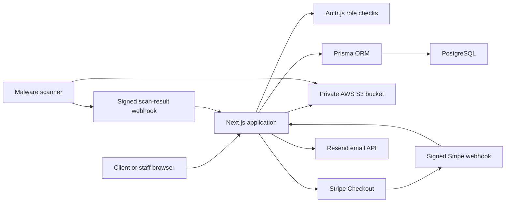

# AllianceAccounting System Architecture

This document describes the Phase 3 codebase as it exists today. It covers the application structure, database, authentication, document storage, payments, and email delivery.

## 1. System overview

AllianceAccounting is a Next.js 15 App Router application written in TypeScript. Public marketing pages, the client portal, staff workspace, and server API routes are deployed together. PostgreSQL stores application records through Prisma. Sensitive free-form text is encrypted before it reaches the database. Client files are stored in a private Amazon S3 bucket. Auth.js provides login sessions, Stripe hosts card checkout, and Resend sends transactional email.



The application does not implement direct public IRS API access. IRS work is limited to tracking taxpayer authorization documents and staff-recorded statuses associated with approved IRS e-Services/TDS procedures.

## 2. Top-level folders and files

### `app/`

The Next.js App Router. A folder containing `page.tsx` becomes a web page. A folder containing `route.ts` becomes an HTTP API endpoint. A `layout.tsx` wraps all pages beneath it.

Public and account page folders:

| Folder | URL | Purpose |
|---|---|---|
| `app/` | `/` | Home page and global HTML layout |
| `app/about/` | `/about` | Firm background and service philosophy |
| `app/services/` | `/services` | Accounting and tax services |
| `app/pricing/` | `/pricing` | Pricing information |
| `app/contact/` | `/contact` | Contact and lead inquiry form |
| `app/faq/` | `/faq` | Frequently asked questions |
| `app/privacy/` | `/privacy` | Privacy Policy |
| `app/terms/` | `/terms` | Terms of Service |
| `app/security/` | `/security` | Data Security Policy |
| `app/register/` | `/register` | Client registration |
| `app/login/` | `/login` | Client/staff login |
| `app/forgot-password/` | `/forgot-password` | Password-reset request |
| `app/reset-password/` | `/reset-password` | Password selection from a valid reset link |

Client portal folders:

| Folder | URL | Purpose |
|---|---|---|
| `app/portal/` | `/portal` | Protected client layout and dashboard summary |
| `app/portal/documents/` | `/portal/documents` | Secure uploads and document history |
| `app/portal/messages/` | `/portal/messages` | Encrypted client-staff message threads |
| `app/portal/invoices/` | `/portal/invoices` | Invoice history, statement download, and Stripe payment |
| `app/portal/tax-status/` | `/portal/tax-status` | Tax preparation status timeline |
| `app/portal/tax-organizer/` | `/portal/tax-organizer` | Encrypted annual organizer questionnaire |
| `app/portal/tasks/` | `/portal/tasks` | Client task checklist |
| `app/portal/appointments/` | `/portal/appointments` | Appointment requests and confirmed meeting links |
| `app/portal/service-requests/` | `/portal/service-requests` | Payroll, sales tax, entity, notice, and bookkeeping requests |

Staff/admin folders:

| Folder | URL | Purpose |
|---|---|---|
| `app/admin/` | `/admin` | Protected staff layout and operational dashboard |
| `app/admin/workflows/` | `/admin/workflows` | Assign tasks, process appointment requests, and review organizer submissions |
| `app/admin/audit-logs/` | `/admin/audit-logs` | Searchable and paginated activity history |

API folders:

| Folder | Endpoint | Main responsibility |
|---|---|---|
| `app/api/auth/[...nextauth]/` | `/api/auth/*` | Auth.js sign-in, sign-out, and session handlers |
| `app/api/auth/register/` | `/api/auth/register` | Create a client account and verification token |
| `app/api/auth/verify-email/` | `/api/auth/verify-email` | Activate an account from a one-time link |
| `app/api/auth/resend-verification/` | `/api/auth/resend-verification` | Replace and resend an unexpired verification workflow |
| `app/api/auth/forgot-password/` | `/api/auth/forgot-password` | Issue a one-hour password-reset link without revealing whether an account exists |
| `app/api/auth/reset-password/` | `/api/auth/reset-password` | Validate a token and replace the bcrypt password hash |
| `app/api/clients/` | `/api/clients` | Staff client list and CSV export |
| `app/api/clients/[id]/` | `/api/clients/:id` | Authorized client detail and profile updates |
| `app/api/documents/` | `/api/documents` | List or upload documents |
| `app/api/documents/[id]/download/` | `/api/documents/:id/download` | Authorize and redirect to a 60-second S3 download URL |
| `app/api/documents/scan-result/` | `/api/documents/scan-result` | Accept authenticated malware scan results |
| `app/api/messages/` | `/api/messages` | List threads or start a secure conversation |
| `app/api/messages/[id]/` | `/api/messages/:id` | Reply to or update a thread |
| `app/api/invoices/` | `/api/invoices` | List client invoices or let staff create one |
| `app/api/invoices/[id]/` | `/api/invoices/:id` | Staff invoice status update |
| `app/api/invoices/[id]/pdf/` | `/api/invoices/:id/pdf` | Download the current text invoice statement |
| `app/api/invoices/[id]/checkout/` | `/api/invoices/:id/checkout` | Create a client-owned Stripe Checkout session |
| `app/api/stripe/webhook/` | `/api/stripe/webhook` | Verify Stripe events and finalize payments |
| `app/api/tax-status/` | `/api/tax-status` | Read status history or let staff update it |
| `app/api/tax-organizer/` | `/api/tax-organizer` | Save, submit, retrieve, and review encrypted organizers |
| `app/api/tasks/` | `/api/tasks` | List or assign client tasks |
| `app/api/tasks/[id]/` | `/api/tasks/:id` | Complete, reopen, edit, or delete an authorized task |
| `app/api/appointments/` | `/api/appointments` | List or create appointment requests |
| `app/api/appointments/[id]/` | `/api/appointments/:id` | Staff confirmation, completion, or cancellation |
| `app/api/service-requests/` | `/api/service-requests` | Create and list encrypted service requests |
| `app/api/irs-authorizations/` | `/api/irs-authorizations` | Track uploaded Form 8821/2848 authorizations only |
| `app/api/audit-logs/` | `/api/audit-logs` | Staff-only filtered/paginated log data |

### `components/`

Reusable React interface components.

| Folder | Contents |
|---|---|
| `components/layout/` | Shared logo, public header/footer, and marketing-page shell |
| `components/marketing/` | Home, Services, Pricing, About, Contact, and legal-page presentation components |
| `components/auth/` | Registration, login, and forgot-password forms |
| `components/portal/` | Client dashboard, shell/navigation, upload, messages, invoices, Stripe payment button, tax tracker, organizer, tasks, appointments, and service requests |
| `components/admin/` | Staff shell/navigation, dashboard, and interactive workflow manager |

### `lib/`

Server-side shared services.

| File | Responsibility |
|---|---|
| `lib/prisma.ts` | Reuses a Prisma client during local hot reload and exposes database access |
| `lib/authz.ts` | Server-page guards for client-only and staff/admin-only pages |
| `lib/api.ts` | API error response and staff-role helpers |
| `lib/security.ts` | AES-256-GCM text encryption/decryption, IP hashing, constant-time secret comparison, HTML escaping, allowed upload types, and 25 MB limit |
| `lib/audit.ts` | Shared audit-event writer |
| `lib/s3.ts` | Configured AWS S3 client; uses explicit credentials when supplied or the host IAM role otherwise |
| `lib/stripe.ts` | Stripe Checkout request and webhook-signature verification |
| `lib/email.ts` | Resend API call and escaped notification HTML template |
| `lib/notifications.ts` | Message/document email routing plus delivery-result audit events |

### `prisma/`

Database definition and change history.

| Folder/file | Purpose |
|---|---|
| `prisma/schema.prisma` | Current PostgreSQL models, enums, indexes, and relationships |
| `prisma/migrations/` | Ordered SQL migrations; Phase 2 creates the foundation and Phase 3 adds payments, organizers, and appointments |
| `prisma/seed.ts` | Optional development admin/client creation; requires explicit seed passwords |

### `src/`

Global styling. `styles.css` contains the original public, portal, admin, responsive, and green/white brand styling. `phase2.css` adds Phase 2 UI details. `phase3.css` adds payments, organizer, tasks, scheduling, workflows, and audit-log layouts.

### `tests/`

Node test files executed through `tsx`. The current suite verifies sensitive-text encryption/decryption and Stripe signature validation, including tampered and stale requests.

### `types/`

TypeScript declarations that add the application user ID and `CLIENT`, `STAFF`, or `ADMIN` role to the Auth.js session types.

### `docs/`

Operational and user documentation. It includes the deployment guide and the three guides described here.

### Generated or dependency folders

`node_modules/` contains installed packages and must not be edited or committed. `.next/` is generated by the Next.js development/build process and must not be committed.

### Important root files

| File | Purpose |
|---|---|
| `.env.example` | Complete environment-variable template without secrets |
| `auth.ts` | Auth.js credentials provider, JWT session, and role-aware route authorization |
| `next.config.ts` | Next.js settings and security headers |
| `package.json` / `package-lock.json` | Commands and pinned dependencies |
| `tsconfig.json` | Strict TypeScript configuration and `@/` import alias |
| `README.md` | Developer setup, security notes, and validation commands |

## 3. Database tables

All business data is stored in PostgreSQL. Prisma model names below correspond to database tables.

### Identity and access

| Table | Purpose and important fields |
|---|---|
| `User` | Login identity, unique email, bcrypt hash, email verification, role, last login, and reserved MFA fields. It is the parent record for clients and staff. |
| `Account` | Auth.js provider-account linkage for future OAuth providers. Credentials login does not currently require a row here. |
| `Session` | Auth.js database-session structure. The active configuration uses signed JWT sessions, so this is not the primary session store. |
| `VerificationToken` | SHA-256 digests of one-time email-verification and password-reset tokens plus expiration. Raw tokens are sent by email and are not stored. |
| `ClientProfile` | Client name, phone, tax year, filing type, assigned staff member, and encrypted address. One profile belongs to one user. |

### Documents and authorization

| Table | Purpose and important fields |
|---|---|
| `Document` | S3 storage key, original display name, category, MIME type, size, scan state, owner, uploader, and upload time. File bytes are not stored in PostgreSQL. |
| `DocumentRequest` | A staff request for a missing client document, with optional category, note, due date, and completion time. |
| `IrsAuthorization` | A client-uploaded Form 8821 or Form 2848 reference, staff verification data, expiration, request reference, and manual status note. It does not call the IRS. |

### Tax workflow

| Table | Purpose and important fields |
|---|---|
| `TaxReturn` | One return per client and tax year, filing type, current one-of-16 preparation status, and last status-update time. |
| `TaxStatusEvent` | Append-style history for tax-status changes, including staff actor, optional note, and timestamp. |
| `TaxOrganizer` | One organizer per client/tax year. Questionnaire answers are stored as AES-256-GCM encrypted JSON with draft/submission/review status. |

### Messaging and work management

| Table | Purpose and important fields |
|---|---|
| `MessageThread` | Client-owned secure conversation subject, status, and timestamps. |
| `Message` | Encrypted message body, sender, read time, and creation time. |
| `MessageAttachment` | Join table connecting a message to a previously stored document. The current client UI does not yet expose attachment selection. |
| `ClientTask` | Staff-created checklist item, optional due date, completion time, client, and staff creator. |
| `AppointmentRequest` | Preferred/alternate time, time zone, duration, mode, topic, encrypted notes, status, meeting URL, and optional assigned staff member. |
| `ServiceRequest` | Client request type, encrypted details, status, and timestamps. |
| `InternalNote` | AES-256-GCM encrypted staff note linked to a client. The database/API foundation exists; no current admin screen edits these notes. |

### Billing

| Table | Purpose and important fields |
|---|---|
| `Invoice` | Unique number, description, amount in integer cents, currency, status, due/paid dates, and Stripe identifiers. |
| `Payment` | Invoice-linked Stripe attempt, checkout/payment identifiers, amount, currency, status, and optional receipt URL. |
| `StripeWebhookEvent` | Processed Stripe event ID and type. The event ID is the primary key, providing webhook idempotency. |

### Leads and auditing

| Table | Purpose and important fields |
|---|---|
| `LeadInquiry` | Public contact/service inquiry name, email, type, details, and creation time. Public inquiry text is not encrypted in the current schema, so the form must not be used for taxpayer data. |
| `AuditLog` | Actor, affected client, action, entity type/ID, hashed IP, user agent, JSON metadata, and timestamp. Used for authentication, documents, messages, billing, workflows, and email outcomes. |

### Core status enums

- User roles: `CLIENT`, `STAFF`, `ADMIN`.
- Document scan: `PENDING`, `CLEAN`, `QUARANTINED`, `REJECTED`.
- Invoice: `UNPAID`, `PAID`, `OVERDUE`, `REFUNDED`.
- Payment: `PENDING`, `SUCCEEDED`, `FAILED`, `REFUNDED`.
- Messages: `OPEN`, `PENDING`, `RESOLVED`.
- Organizers: `DRAFT`, `SUBMITTED`, `NEEDS_UPDATE`, `REVIEWED`.
- Appointments: `REQUESTED`, `CONFIRMED`, `COMPLETED`, `CANCELLED`.
- Service requests: `NEW`, `IN_PROGRESS`, `WAITING`, `COMPLETED`, `CANCELLED`.
- Tax returns use the 16-step workflow from client registration through completion and archive.

## 4. Authentication and authorization

### Registration and verification

1. Registration accepts a name, valid email, and password from 12 to 128 characters.
2. The password is hashed with bcrypt at cost factor 12. Plaintext passwords are never stored.
3. A client `User` and `ClientProfile` are created in one database transaction.
4. A random verification token is generated. Only its SHA-256 digest is stored; the email receives the raw token.
5. The verification link expires after 24 hours. Login is rejected until `emailVerified` is populated.

### Login and session

Auth.js uses the credentials provider. It looks up the normalized email, verifies the bcrypt hash, rejects unverified accounts, records the login, and issues a signed JWT session cookie. Sessions last up to eight hours and are refreshed at most every 15 minutes while active. Production must use HTTPS so cookies are transported securely.

### Password reset

The reset endpoint always returns the same response whether or not an email exists. A valid account receives a random one-hour token. Only its SHA-256 digest is stored. Successful reset replaces the bcrypt hash, deletes the token, and writes an audit event.

### Role-based authorization

- `CLIENT` may enter `/portal` and API handlers restrict records to that user's ID.
- `STAFF` and `ADMIN` may enter `/admin` and use staff API operations.
- Page layouts perform a first authorization check.
- API routes perform independent role and object-ownership checks; the UI is not trusted as a security boundary.

The schema contains encrypted MFA-secret fields, but Phase 3 does not yet include a completed MFA enrollment/challenge flow. Provider-account MFA must be enabled, and the portal should not be represented as having user MFA until that flow is implemented and tested.

## 5. AWS S3 document architecture

1. An authenticated client or staff member submits a supported file and category to `/api/documents`.
2. The server permits PDF, JPEG, PNG, DOCX, XLSX, and CSV up to 25 MB. The MIME type and size are checked server-side.
3. The server reads the file, calculates a SHA-256 checksum, and creates an opaque key: `clients/{clientId}/{UTC year}/{random UUID}`. Client names and filenames are not used as S3 keys.
4. The object is uploaded to the private bucket with attachment disposition, MIME type, checksum, client metadata, and server-side encryption. A configured KMS key uses SSE-KMS; otherwise S3 AES-256 encryption is requested.
5. PostgreSQL receives only the object metadata and storage key. The new record starts as `PENDING`, and the upload is audited.
6. An external malware scanner must inspect the object and POST `CLEAN`, `QUARANTINED`, or `REJECTED` to `/api/documents/scan-result` using `x-scan-webhook-secret`.
7. Downloads are blocked unless the database status is `CLEAN`.
8. An authorized download request creates a 60-second presigned S3 URL, writes an audit event, and redirects the browser.

The S3 bucket must have all public access blocked, versioning, encryption, least-privilege IAM, logging, lifecycle rules aligned to firm policy, backups, and tested malware scanning. When hosted on AWS, use an IAM role. On Vercel, use a dedicated least-privilege IAM access key—never root credentials.

## 6. Stripe payment architecture

1. Only an authenticated client can start checkout, and the invoice must belong to that client with status `UNPAID` or `OVERDUE`.
2. The server builds a Stripe Checkout request using the trusted database amount, currency, invoice number, description, and client email. The browser cannot set the charge amount.
3. Stripe returns a hosted checkout URL. The app records the checkout session and a `PENDING` payment attempt, then redirects the client to Stripe.
4. Stripe sends the result to `/api/stripe/webhook`. The server verifies the `Stripe-Signature` HMAC with `STRIPE_WEBHOOK_SECRET` and rejects timestamps older than five minutes.
5. The event ID is inserted into `StripeWebhookEvent`. A duplicate ID is safely acknowledged without reprocessing.
6. For a paid `checkout.session.completed` event, the server compares Stripe amount/currency to the invoice, marks the invoice and payment paid, stores Stripe identifiers, and writes an audit event—all in a transaction.
7. An expired session marks the pending payment attempt failed.

Card numbers never pass through or reside in AllianceAccounting. Refund automation, dispute handling, recurring billing, and asynchronous payment-method events are not implemented in Phase 3. The current invoice “PDF” endpoint produces a downloadable text statement; true PDF generation remains future work.

## 7. Resend email architecture

`lib/email.ts` calls the Resend REST API using `RESEND_API_KEY` and the verified `EMAIL_FROM` identity. The shared template HTML-escapes dynamic text and deliberately excludes sensitive financial details.

Email is currently used for:

- New-account verification and verification resend.
- Password-reset links.
- Verification success.
- New secure-message notifications to the client or assigned staff/admin recipients.
- Client-document upload notification to staff.
- Clean or rejected document scan results to the client.

Email delivery or skipped delivery is written to `AuditLog` for notification workflows. If Resend is not configured, the application does not expose secrets or crash the account workflow; it records that delivery was skipped. Production requires a verified sending domain with SPF/DKIM and a correct HTTPS `NEXT_PUBLIC_APP_URL`.

## 8. Security and operational boundaries

- Free-form messages, organizer answers, service-request details, appointment notes, addresses, and internal notes use AES-256-GCM via `DATA_ENCRYPTION_KEY`.
- Losing or changing that key without a re-encryption plan makes existing encrypted data unreadable.
- HTTPS/HSTS, database/S3 backups, WAF/rate limiting, malware scanning, monitoring, key management, and restoration testing are deployment responsibilities.
- No SSN field exists. Users must not enter SSNs in organizer notes, messages, public contact forms, logs, or email.
- Audit logs support investigation but must be protected from unauthorized modification and included in retention planning.
- The app is a technical foundation, not proof of legal or IRS compliance. Before real taxpayer data, complete a professional security assessment and IRS Publication 4557-aligned WISP.

## 9. Validation and release

The committed validation commands are:

```powershell
npm.cmd test
npm.cmd run typecheck
npm.cmd run build
npm.cmd audit --omit=dev
npx.cmd prisma validate
```

Production releases must apply committed migrations with `npm.cmd run db:deploy` before or alongside deployment. Never use the development migration command against production.
